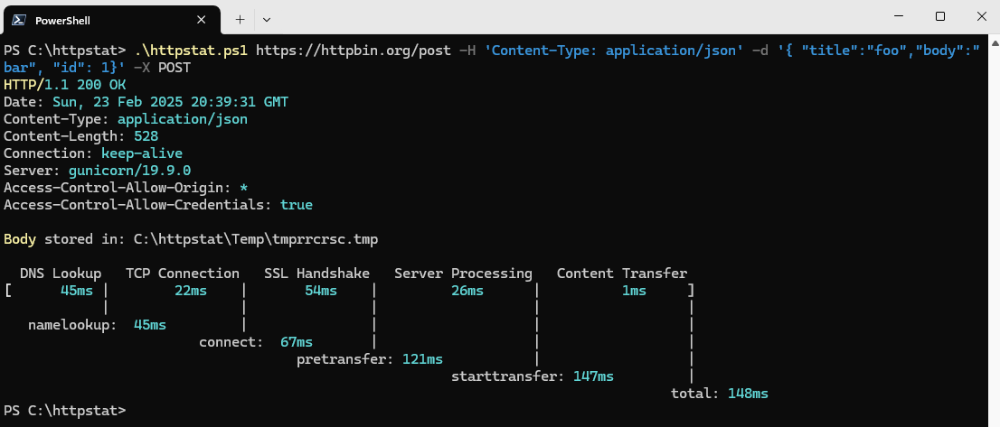

# httpstat
It's like curl -v, with colors.



## Usage

```console
> .\httpstat.ps1 --help
Usage: httpstat URL [CURL_OPTIONS]
       httpstat --help
       httpstat --version
Arguments:
  URL     url to request, could be with or without http(s):// prefix
Options:
  CURL_OPTIONS  any curl supported options, except for -w -D -o -S -s,
                which are already used internally.
  --help     show this screen.
  --version     show version.
Environments:
  HTTPSTAT_SHOW_HEAD    By default httpstat will write response headers
                        in a tempfile and print them but you can prevent
                        printing out by setting this variable to false.
  HTTPSTAT_SHOW_BODY    By default httpstat will write response body
                        in a tempfile, but you can let it print out by setting
                        this variable to true.
  HTTPSTAT_SHOW_SPEED   set to true to show download and upload speed.
```

### Environment Variables

```console
$env:HTTPSTAT_SHOW_HEAD="false"
$env:HTTPSTAT_SHOW_SPEED="true"
$env:HTTPSTAT_SAVE_BODY="false"
```


## Implementations

Many thanks.

- https://github.com/reorx/httpstat
- https://github.com/davecheney/httpstat
- https://github.com/yosuke-furukawa/httpstat
- https://github.com/tcnksm/go-httpstat
- https://github.com/babarot/httpstat/tree/master

## Author

bmcculley

## License

[MIT](LICENSE)